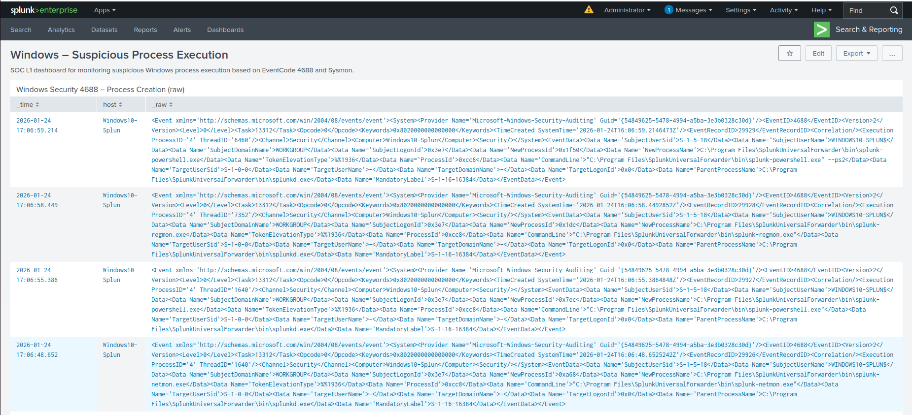
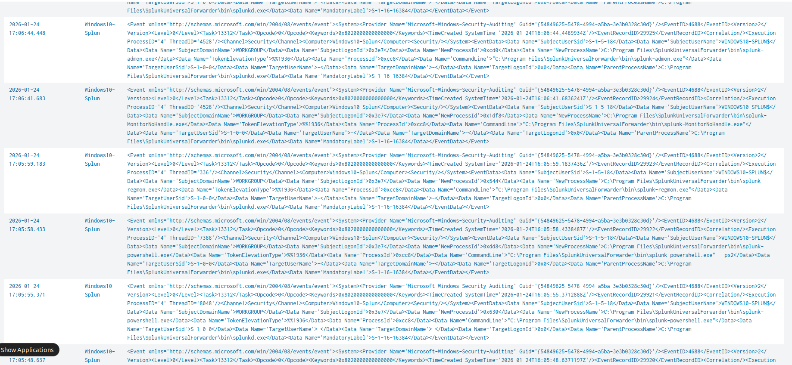
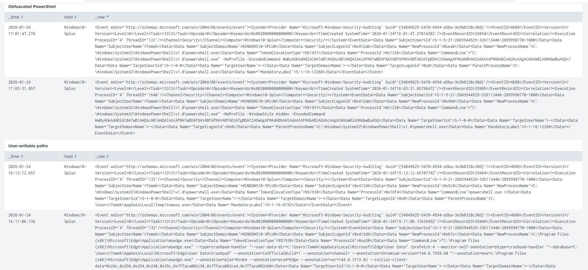

# Detection: Suspicious Process Execution

## Description
This detection focuses on identifying suspicious process executions on Windows endpoints.
It uses Sysmon and Windows Security logs as a baseline SOC L1 detection for triage and investigation.

The goal is to provide visibility into process creation activity and allow analysts to quickly identify:
- unusual binaries
- suspicious execution paths
- abnormal parent-child relationships
- potential post-compromise activity

---

## Data Sources

### Sysmon
- Log source: Microsoft-Windows-Sysmon/Operational
- EventCode: 1 (Process Create)

### Windows Security
- Log source: Security
- EventCode: 4688 (Process Creation)

## Detection Logic

Windows Security Event 4688 is ingested as XML (`XmlWinEventLog:Security`).
Field extraction for this log source may be incomplete or unavailable, depending on the ingestion method.

For this reason, all core detection logic operates directly on raw XML data (`_raw`)
using token-based matching and lightweight regular expressions, rather than relying
on extracted fields such as:

- NewProcessName
- ParentProcessName
- CommandLine

### Sysmon – Process Create (EventCode 1)

```spl
index=windows source="WinEventLog:Microsoft-Windows-Sysmon/Operational" EventCode=1
| table _time host User Image ParentImage CommandLine

```

### Windows Security – Process Creation (EventCode 4688)

**Baseline / ingest validation**

```spl
index=windows sourcetype="XmlWinEventLog:Security" EventCode=4688
| table _time host _raw
| sort -_time

```
**PowerShell triage (token search)**

This search uses token-based matching rather than exact string comparison,
making it reliable even when XML field extraction is unavailable.
The term `powershell` is treated as a search token and matched anywhere in the raw event,
including executable paths and command-line arguments.


```spl

index=windows sourcetype="XmlWinEventLog:Security" EventCode=4688 powershell
| table _time host _raw
| sort -_time

```

#### Splunk – EventCode 4688 (Ingest validation)
#### Simulated attack – C2 proof (redacted)

The screenshot below confirms an active C2 session on the target host.
Only post-compromise context is shown. No attack techniques or payloads are exposed.


#### Suspicious PowerShell Execution (Obfuscation)

```spl
index=windows sourcetype="XmlWinEventLog:Security" EventCode=4688
powershell ("-enc" OR "-encodedcommand" OR "-nop" OR "-w hidden" OR "-windowstyle hidden")
| regex _raw="(?i)powershell(\.exe)?"
| table _time host _raw
| sort - _time


```

#### Suspicious Execution from User Writable Paths

```spl
index=windows sourcetype="XmlWinEventLog:Security" EventCode=4688
("\\Users\\" AND ("\\AppData\\" OR "\\Temp\\"))
| table _time host _raw
| sort - _time


```
#### Abnormal Parent–Child Process Relationship (LOLBIN + user-writable staging)

```spl
index=windows sourcetype="XmlWinEventLog:Security" EventCode=4688
("powershell.exe" OR "cmd.exe" OR "mshta.exe" OR "rundll32.exe")
("\\Users\\" AND ("\\AppData\\" OR "\\Temp\\"))
NOT "SplunkUniversalForwarder"
| table _time host _raw
| sort - _time


```
## Optional: XML Field Extraction (Analysis Only)

The following extractions improve investigation readability.
Detection logic must not depend on these fields.

```spl
index=windows sourcetype="XmlWinEventLog:Security" EventCode=4688
| rex field=_raw "Data Name='NewProcessName'>(?<NewProcessName>[^<]+)"
| rex field=_raw "Data Name='ParentProcessName'>(?<ParentProcessName>[^<]+)"
| rex field=_raw "Data Name='CommandLine'>(?<CommandLine>[^<]+)"
| table _time host ParentProcessName NewProcessName CommandLine
| sort -_time

```


## MITRE ATT&CK Mapping

- T1059.001 – Command and Scripting Interpreter: PowerShell
- T1204 – User Execution
- T1036 – Masquerading
- T1106 – Native API

## False Positives

- Administrative PowerShell usage by IT staff
- Legitimate software installers or updaters using PowerShell
- Endpoint management and EDR tools executing PowerShell
- Custom enterprise scripts executed from user writable paths

## Analyst Triage Guidance

1. Review `CommandLine` for obfuscation flags:
   - `-enc`, `-encodedcommand`, `-nop`, `-w hidden`
2. Validate execution path:
   - User-writable paths such as `AppData` or `Temp` increase risk
3. Check parent process legitimacy:
   - `explorer.exe` spawning scripting engines is suspicious
4. Correlate with:
   - User activity
   - Host role
   - Recent alerts on the same endpoint

## Severity and Response

- **Severity**: Medium → High  
- **Escalate to High** if:
  - Encoded PowerShell is used
  - Execution originates from user writable paths
  - Suspicious parent-child relationship is observed

### Recommended Response Actions
- Isolate endpoint if malicious activity is confirmed
- Acquire memory and disk artifacts
- Review additional process activity on the host
- Reset user credentials if compromise is suspected

#### Example Windows Event (4688 – Process Creation)


The screenshot shows a raw XML view of Windows Security Event 4688,
used to validate field availability and justify raw-based detection logic.

## Dashboard

This detection is visualized using a Splunk dashboard built directly on the searches defined above.
The dashboard is designed for SOC L1 triage and focuses on:
- process creation volume
- suspicious PowerShell usage
- execution from user-writable paths
- potential post-compromise activity

Detection panels operate on raw XML (`_raw`) to avoid dependency on field extraction.

## Dashboard Validation (Evidence)

The following screenshots document the **Windows – Suspicious Process Execution** Splunk dashboard.
They provide end-to-end validation of the detection logic using simulated encoded PowerShell execution
captured via Windows Security EventCode 4688.


### Raw Process Creation Visibility (EventCode 4688)

The screenshots below show raw Windows Security EventCode **4688 – Process Creation** events
displayed directly from `_raw` XML.

This view confirms that process creation telemetry is correctly ingested and that full command-line,
parent process, and execution context are available without reliance on field extraction.







### Obfuscated / Encoded PowerShell Execution Detection

This screenshot presents detected PowerShell executions that include obfuscation indicators such as
`-EncodedCommand`, hidden execution, and non-interactive flags.

The panel highlights suspicious PowerShell activity commonly associated with post-exploitation
or malware execution techniques.


### Encoded PowerShell Correlation View

This view shows correlated encoded PowerShell executions extracted from EventCode 4688,
including timestamps, affected hosts, and full encoded command lines.

It confirms that the detection consistently identifies multiple occurrences of obfuscated
PowerShell execution across events.




### High-Risk Indicator – Obfuscated PowerShell

This single-value panel displays the total number of detected obfuscated PowerShell executions.

The indicator turns **red** when activity is present, providing a clear **HIGH RISK** signal
for SOC L1 analysts and enabling immediate prioritization.


---
