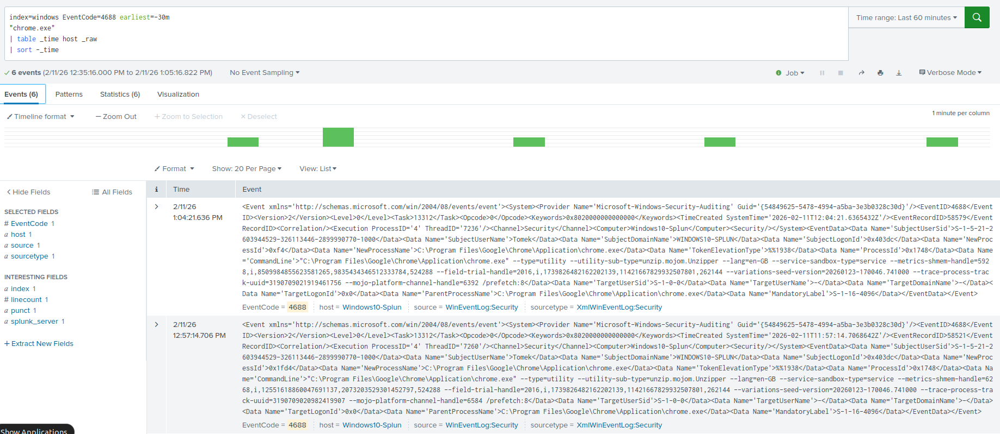
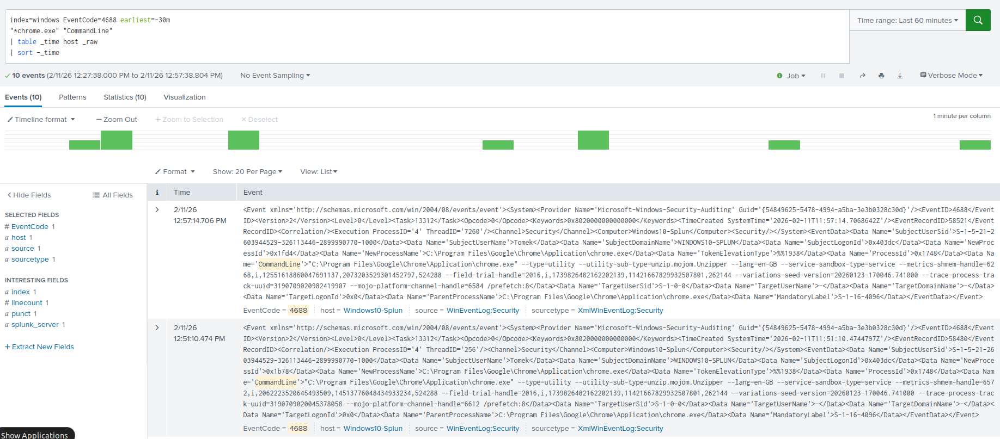
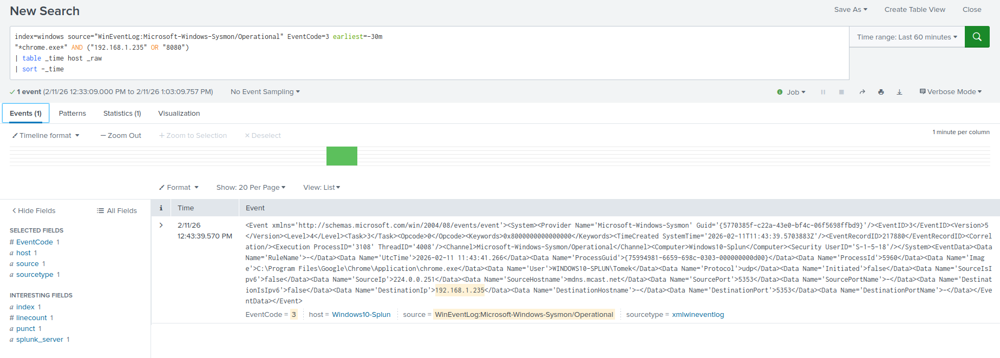

# Phishing Case – Fake Banking Portal (HTTP Simulation)

---

## Objective

Simulate a phishing scenario in which a user clicks a malicious banking link.

Goals (SOC L1 perspective):

- confirm user interaction
- correlate process + network telemetry
- determine whether compromise occurred
- document investigation workflow

---

## Lab Environment

- SIEM: Splunk Enterprise (index=windows)
- Endpoint: Windows 10 (Security logs + Sysmon)
- Log Forwarding: Splunk Universal Forwarder
- Phishing Page Hosting: Ubuntu (`python3 -m http.server 8080`)
- Virtualization: VirtualBox
- Network: 192.168.1.0/24 (lab environment)

Phishing page accessed in lab:
http://192.168.1.235:8080

---

# Investigation – Phishing Page Verification (SOC L1 Workflow)

---

## Step 1 – Process Creation (Browser Launch Confirmation)

### Query

```spl
index=windows EventCode=4688 earliest=-30m
"*chrome.exe"
| table _time host _raw
| sort -_time
```

### Verification

- Event ID 4688 observed
- `_raw` contains chrome.exe
- ParentProcessName = explorer.exe
- Timestamp matches user click
- Execution performed under logged user

### Evidence



### Conclusion

User-initiated browser execution confirmed.

---

## Step 2 – Command Line Inspection

### Query

```spl
index=windows EventCode=4688 earliest=-30m
"*chrome.exe" "CommandLine"
| table _time host _raw
| sort -_time
```

### Verification

- CommandLine field present
- HTTP usage observed (no TLS)
- Possible reference to direct IP and port 8080
- ParentProcessName consistent with interactive user action
- No suspicious execution flags

### Evidence



### Conclusion

Browser execution parameters reviewed. No suspicious flags detected.

---

## Step 3 – Network Connection Confirmation (Sysmon Event ID 3)

### Query

```spl
index=windows source="WinEventLog:Microsoft-Windows-Sysmon/Operational" EventCode=3 earliest=-30m
"*chrome.exe*" AND ("192.168.1.235" OR "8080")
| table _time host _raw
| sort -_time
```

### Verification

- Event ID 3 confirmed
- Image = chrome.exe
- DestinationIp = 192.168.1.235
- DestinationPort = 8080
- Outbound TCP connection initiated

### Evidence



### Conclusion

HTTP outbound connection to phishing infrastructure confirmed.

---

## Step 4 – Post-Click Execution Check

### Query

```spl
index=windows EventCode=4688 earliest=-30m
("cmd.exe" OR "powershell.exe" OR "mshta.exe" OR "wscript.exe" OR "rundll32.exe" OR "certutil.exe")
"chrome.exe"
| table _time host _raw
| sort -_time
```

### Result

No events returned.

### Verification

- No suspicious child processes spawned by chrome.exe
- No PowerShell execution detected
- No command interpreter activity
- No LOLBins observed

### Conclusion

No payload execution detected. Activity limited to browser interaction only.

---

## Step 5 – Domain & Infrastructure Verification

### Observed Infrastructure Indicators

- Direct IP usage instead of legitimate banking domain
- Non-standard port (8080)
- HTTP protocol (no encryption)

These characteristics are frequently associated with phishing infrastructure.

---

### WHOIS / Domain Verification (Conceptual – Lab)

In a real phishing investigation the following should be verified:

- Domain registration date
- Domain age (new domains < 30 days indicator)
- Registrar information
- Privacy protection status
- IP reputation
- Blacklist presence

Newly registered domains are commonly used in phishing campaigns.

---

### Email Authentication (Conceptual)

If phishing originated via email, the following must be verified:

- SPF result
- DKIM result
- DMARC result

Indicators of increased risk:

- SPF fail
- DKIM fail
- DMARC fail
- Lookalike domain with successful authentication

---

# Final SOC L1 Assessment

---

## Findings

- Browser launch confirmed (Event ID 4688)
- HTTP outbound connection confirmed (Sysmon Event ID 3)
- Direct IP access with non-standard port
- No post-click exploitation detected
- No suspicious child process activity observed

---

## Incident Classification

Phishing exposure without confirmed endpoint compromise.

---

## Recommended Actions

- Reset potentially exposed credentials
- Monitor authentication logs
- Conduct user awareness training
- Continue monitoring outbound activity
