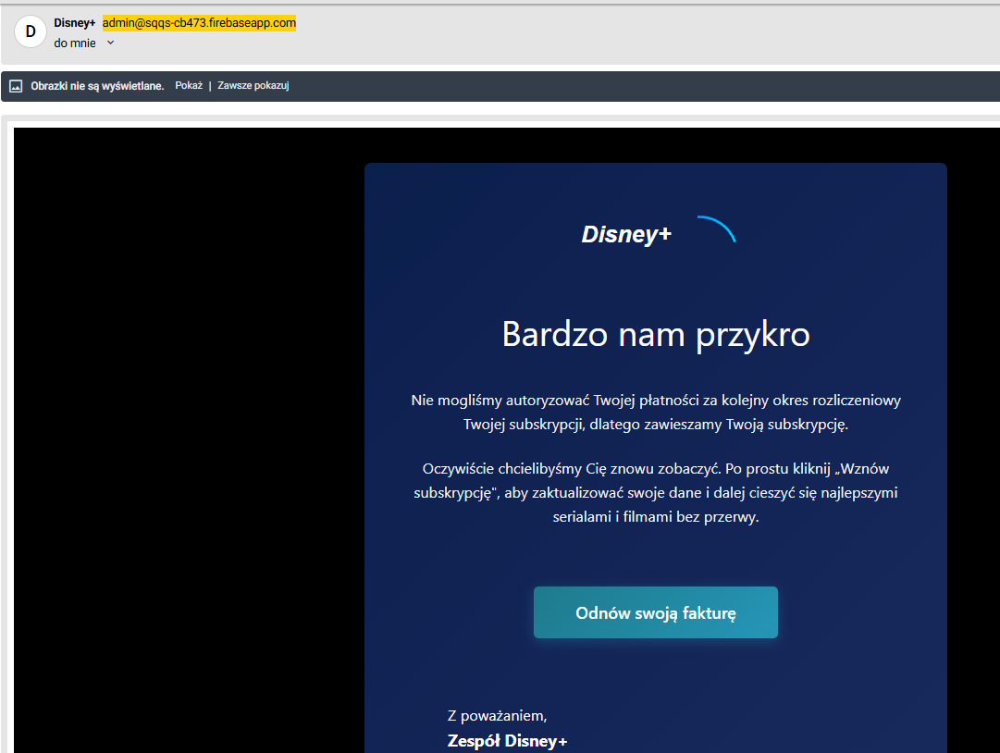
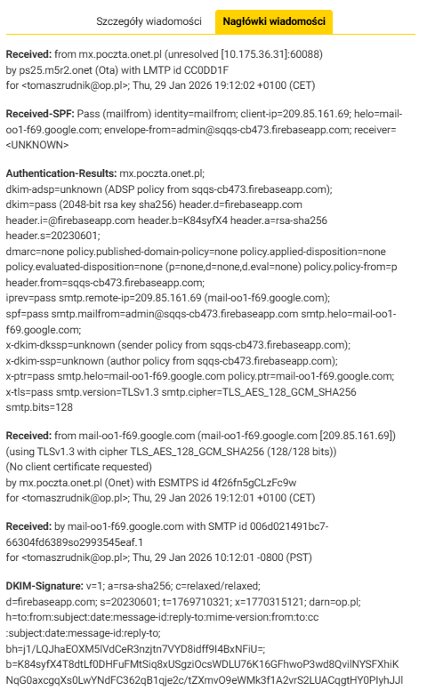
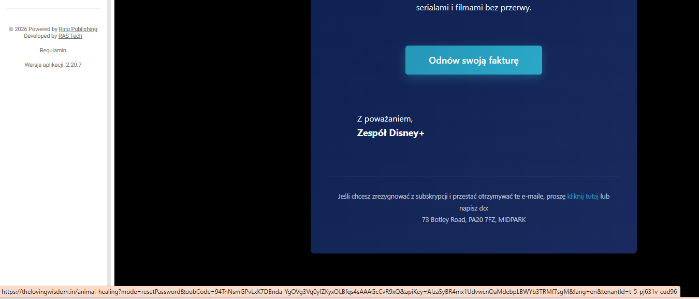

# Real Phishing Email – Manual Investigation (No SIEM Logs)

---

## Objective

Analyze a real phishing email using manual verification techniques:
- header analysis
- domain reputation
- redirect analysis
- infrastructure verification
- OSINT validation

This investigation does not use endpoint logs.

---

# 1. Email Overview

Subject:
Nie mogliśmy autoryzować Twojej płatności za subskrypcję.

Impersonated Brand:
Disney+

Observed Sender:
admin@sqqs-cb473.firebaseapp.com

---

# 2. Header Analysis

## 2.1 SPF

Result:
SPF = PASS

Interpretation:
Email was sent from an authorized SMTP server.

---

## 2.2 DKIM

Result:
DKIM = PASS  
Signed by: firebaseapp.com

Interpretation:
The message was cryptographically signed and not altered in transit.

---

## 2.3 DMARC

Result:
DMARC = PASS

Interpretation:
Domain alignment passed policy validation.

---

## 2.4 Conclusion – Authentication

This is NOT classic spoofing.

The email was sent using legitimate cloud infrastructure (Firebase / Google SMTP).

This indicates infrastructure abuse rather than header forgery.

---

# 3. Link Analysis

Observed URL (hover preview):

https://thelovingwisdom.in/animal-healing?...

Indicators:

- Domain unrelated to Disney
- Suspicious query string parameters
- No brand consistency
- Redirect behavior observed

---

# 4. Domain Reputation Check

Checked using:

- VirusTotal
- WHOIS lookup
- Certificate inspection

---

## 4.1 VirusTotal Results

Domain:
thelovingwisdom.in

Detection:
12/93 vendors flagged as malicious

Examples:
- ESET → Phishing
- BitDefender → Malware
- Fortinet → Malware
- Sophos → Malware

Assessment:
Confirmed malicious infrastructure.

---

## 4.2 WHOIS Analysis

Domain:
thelovingwisdom.in

Registrar:
Endurance Digital Domain Technology Private Limited

Indicators:

- Hosting provider unrelated to Disney
- Domain not associated with official brand infrastructure

---

## 4.3 SSL Certificate

TLS present (Let's Encrypt)

Interpretation:
Presence of HTTPS does NOT indicate legitimacy.

Phishing pages often use valid TLS certificates.

---

# 5. Attack Pattern Identified

This case represents:

- Brand impersonation
- Legitimate infrastructure abuse
- External malicious redirect
- Active phishing campaign

Not observed:

- Email spoofing
- Header forgery
- Malware attachment

---

# 6. Risk Assessment

Severity: HIGH

Reasons:

- Active phishing domain
- Multiple AV detections
- Credential harvesting likely
- Social engineering pressure (subscription suspension)

---

# 7. SOC L1 Manual Workflow Summary

Steps performed:

1. Header verification
2. SPF / DKIM / DMARC validation
3. Link preview without clicking
4. Domain reputation check
5. WHOIS inspection
6. Infrastructure validation
7. Brand mismatch confirmation

---

# Final Classification

Phishing – Infrastructure Abuse

This case demonstrates a higher sophistication level than basic spoofed emails.
